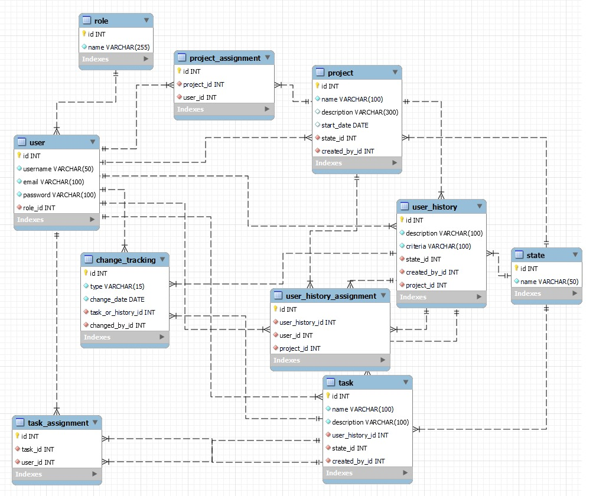

# 📌 ApiDesignacionTareas

## 📖 Overview
**ApiDesignacionTareas** es un sistema de gestión de proyectos desarrollado en **Node.js + Express** que expone una API REST para administrar proyectos, historias de usuario y tareas en un flujo de trabajo jerárquico.  

Incluye autenticación basada en **JWT** y control de acceso por roles (**Gerente** y **Desarrollador**) para asegurar un manejo adecuado de permisos.  

---

## 🎯 Purpose and Scope
El objetivo de esta API es proporcionar una herramienta centralizada para:
- Crear y administrar proyectos.
- Definir historias de usuario (user histories).
- Asignar y dar seguimiento a tareas.
- Controlar accesos y permisos mediante autenticación y roles.  

El sistema cubre arquitectura, capa de datos, seguridad, controladores de API y despliegue en la nube.

---

## 🏗️ System Architecture
El sistema sigue una arquitectura de **tres capas** con un modelo de datos jerárquico:

1. **Proyectos**  
   ↳ 2. **Historias de Usuario (User Histories)**  
   ↳ ↳ 3. **Tareas (Tasks)**  

Cada nivel está relacionado de manera jerárquica, permitiendo organizar desde lo macro (proyecto) hasta lo granular (tareas individuales).

---

## 🔑 Core Components
- **Gestión jerárquica del trabajo:** proyectos → historias de usuario → tareas.  
- **Autenticación:** JWT con `Passport.js`.  
- **Autorización:** permisos diferenciados para *Gerente* y *Desarrollador*.  
- **Base de datos:** PostgreSQL en AWS RDS.  
- **Seguridad:** contraseñas encriptadas con **bcrypt**.  
- **Despliegue:** Heroku (producción).  

---

## 🚀 Technology Stack
| Componente        | Tecnología         | Propósito                                |
|-------------------|-------------------|------------------------------------------|
| Runtime           | Node.js           | Ejecución del servidor                   |
| Web Framework     | Express.js        | Routing y middlewares REST               |
| Base de Datos     | PostgreSQL (AWS RDS) | Persistencia relacional                 |
| Cliente DB        | pg-promise + bluebird | Interfaz promesas con PostgreSQL      |
| Autenticación     | JWT + Passport.js | Seguridad sin estado                     |
| Password Hashing  | bcrypt            | Seguridad de contraseñas                 |
| Hosting           | Heroku            | Despliegue en la nube                    |

---

## 🔗 API Endpoints Overview
| Categoría              | Base Path           | Operaciones principales               | Auth requerida |
|-------------------------|--------------------|---------------------------------------|----------------|
| **Usuarios**            | `/api/users/`      | create, login, getAll                 | Parcial        |
| **Proyectos**           | `/api/projects/`   | create, addDev, delDev, viewProjects  | ✅ JWT         |
| **Historias de Usuario**| `/api/userHistory/`| create, update, delete                | ✅ JWT         |
| **Tareas**              | `/api/task/`       | create, update, delete, assignment    | ✅ JWT         |

---

## 👥 Role-Based Access Control
- **Gerente:** puede crear y administrar proyectos, asignar y remover desarrolladores.  
- **Desarrollador:** recibe asignación de tareas y actualiza su estado.  

---

## 🔒 API Authentication Flow
Todos los endpoints protegidos requieren autenticación con **JWT** usando el header:


---

## 🗄️ Database Connection
- **Host:** `ec2-54-86-180-157.compute-1.amazonaws.com`  
- **Cliente:** `pg-promise` + `bluebird`  
- **SSL:** obligatorio para conexión segura  

---

## 🌍 Deployment & Production
- **Producción:** [https://project-manager-api-01efc442a29d.herokuapp.com](https://project-manager-api-01efc442a29d.herokuapp.com)  
- **Base de Datos:** AWS RDS PostgreSQL  
- **Servidor:** Node.js + Express  

---

## 📂 Relevant Source Files
- `README.md` → Documentación principal  
- `Documentacion postman.json` → Colección Postman con pruebas y ejemplos  
- `MER Projects.jpeg` → Diagrama entidad-relación del sistema  
- Código fuente → Endpoints, controladores, modelos y configuración  

---

## 📬 API Documentation
La documentación detallada de endpoints y pruebas está disponible en la colección de Postman incluida en el repo:  

➡️ **`Documentacion postman.json`**

---

## ⚙️ Setup (Local Development)
1. Clonar el repositorio:  
   ```bash
   git clone <repo-url>
   cd ApiDesignacionTareas
   ```

2. Instalar dependencias: 
   ```bash
   npm install
   ```

3. Crear archivo `.env` a partir de `.env.example` y configurar: 
   ```bash
  	PORT=3000
	DATABASE_URL=<your-db-url>
	JWT_SECRET=<your-secret>
   ```
4. Iniciar el servidor:
   ```bash
   npm run dev
   ```
   o
   ```bash
   npm start
   ```

5. Probar en:
   ```bash
   http://localhost:3000
   ```

## 📸 Screenshots & Diagrams



**Archivo:** `MER-Projects.jpeg`  
**Descripción:** Diagrama Entidad–Relación (MER) que muestra las tablas y relaciones principales (projects, user_histories, tasks, users, roles, assignments, etc.).

---

## 📜 License

Este proyecto es de uso **académico y formativo**.

Si deseas incluir un archivo `LICENSE` simple, puedes usar el siguiente texto:

~~~text
Copyright (c) 2025 <Tu Nombre>

Este proyecto se publica únicamente con fines académicos y formativos.
No se ofrece garantía y no debe usarse en producción sin revisar y adaptar
el código y las dependencias.
~~~
